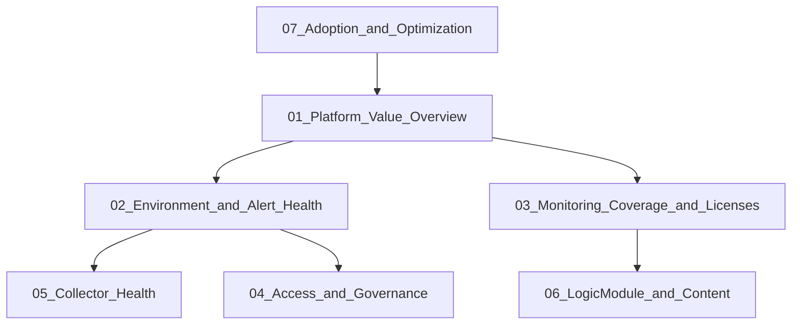
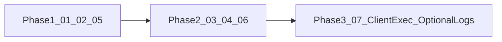

# SmartAdmin Dashboard Experience Proposal

**Document type:** Design and strategy proposal (no production changes)  
**Sources reviewed:** `SmartAdmin Dashboards.json`, `Introductive_Dashboard.json`, `Design_Template.json`  
**LogicMonitor format:** Santaba release 242 dashboard / dashboard-group exports  
**Status:** Proposal only — do not apply to production until an implementation phase is approved

---

## 1. Executive Summary

The current SmartAdmin suite is a strong **portal administration** pack: it surfaces LogicMonitor account health, alert volume, collector performance, licenses, access hygiene, and LogicModule inventory. It does not yet present a progressive, client-oriented experience that helps leaders and operators move from “are we healthy?” to “what should we do next?”

This proposal redesigns the experience into a **seven-dashboard progressive suite** under a group such as **SmartAdmin Client Experience**. Users start with a Platform Value Overview, then drill into alert/environment health, coverage and licenses, access governance, collector health, LogicModule content, and adoption/optimization.

The redesign reuses effective widgets and confirmed portal datasources, collapses exact duplicates (especially the twin Collector Health dashboards), adopts the Design Template’s guided executive review pattern, and treats logs as **LogSource health signals**—not raw log streams on landing pages.

| Outcome | Approach |
|---------|----------|
| Cleaner navigation | One entry dashboard + clear drill-downs |
| Less duplication | Single owner per metric family |
| Greater client value | Value/coverage KPIs + actionable ops views |
| Technical realism | Phase 1–2 limited to metrics present in exports |
| Future growth | Phase 3 for client-specific infra/service patterns |

---

## 2. Objectives of the Dashboard Redesign

1. Help clients understand overall platform and environment health at a glance.  
2. Make active problems and emerging risks visible and prioritizable by severity.  
3. Reduce cognitive load by removing duplicate dashboards and overlapping scorecards.  
4. Present information progressively: executive → operational → technical.  
5. Demonstrate operational value delivered by LogicMonitor (coverage, collectors, alert hygiene, adoption).  
6. Preserve and reuse effective existing components; document any removed functionality.  
7. Establish visual and naming standards so new users can interpret dashboards without deep platform knowledge.  
8. Provide an implementation-ready blueprint phased for delivery risk and client benefit.

**Non-objectives for this document**

- Modifying production dashboard JSON.  
- Inventing metrics or capabilities not supported by the provided exports.  
- Building client-specific infrastructure/service dashboards without confirmed datasources (deferred to Phase 3 with dependencies).

---

## 3. Summary of the Current Dashboards

### 3.1 Materials inventory

| Material | Type | Contents |
|----------|------|----------|
| `SmartAdmin Dashboards.json` | Dashboard group | 8 dashboards, ~180 widgets |
| `Introductive_Dashboard.json` | Single dashboard | 28 widgets; Harvard-branded onboarding/overview |
| `Design_Template.json` | Single dashboard | 12 widgets; PSC executive network-health pattern |

No README, screenshots, or external documentation were present in the repository. All findings below are from export JSON unless marked **Assumption**.

### 3.2 SmartAdmin dashboards (production pack)

| Dashboard | Widgets | Intended audience (inferred) | Purpose | Primary information shown |
|-----------|---------|------------------------------|---------|---------------------------|
| SmartAdmin High Level Overview | 30 | Admins, leads | Portal status snapshot | Alert severity totals, map, NOC, dead resources/websites, collector up/down, users, licenses, LogicModule counts |
| SmartAdmin Alerts and DataSource Performance | 36 | Admins, ops | Alert and monitoring hygiene | Severity scorecards, alert trends, top datasources, rules/escalations/integrations, dead/minimal/netflow/SDT resources, netscans, LogicModule alert tables (90 days) |
| SmartAdmin Users Roles and API Tokens | 13 | Security, portal admins | Access inventory | Users, API users, roles, groups, tokens, idle users/tokens (90 days) |
| SmartAdmin Device Groups and Websites | 9 | Portal admins | Group/website hygiene | Device/website group counts, empty groups, dead websites |
| SmartAdmin LogicModule Status | 16 | Content/admins | Module inventory | Counts of DataSources, EventSources, ConfigSources, PropertySources, LogSources, TopologySources, SNMP SYSOID maps, AppliesTo functions |
| SmartAdmin Cloud/Local - License Counts | 14 | Admins, capacity planners | License consumption | AWS/Azure/GCP IaaS/PaaS/non-compute, local licenses and percent, totals |
| Collector Health | 31 | Platform engineers | Collector performance | Instance counts by method, JVM table, heap/CPU trends, collection/AD task graphs and tables, collector alerts |
| SmartAdmin Collector Health | 31 | Same as above | **Exact duplicate** of Collector Health | Same widget signature set (31/31 match) |

**Common tokens:** `defaultResource` / `defaultResourceName` typically `*.logicmonitor.com` or `*`; `defaultResourceGroup` typically `*`. License dashboard uses `accountname` = `proservices` (**confirmed** in export; may be environment-specific).

**Widget types in use:** `bigNumber`, `cgraph`, `dynamicTable`, `text`, `alert`, `gmap`, `noc`.

### 3.3 Introductive Dashboard

| Aspect | Detail |
|--------|--------|
| Purpose | Onboarding + real-time portal snapshot with Learn/Support links |
| Audience | New users, operators needing guided navigation |
| Sections | Banner; Support & Critical Navigation; Alerts; Collectors; Users and Resources |
| Metrics | Warning/Error/Critical/total alerts; escalation chains; dead resources; alert trend; map; alive collectors (Linux/Windows); collector alerts; JVM table; active/API users; groups; tokens; idle users |
| Distinctive value | Educational HTML panels; links to Office Hours and tiered critical operational dashboards (Service Health, EIP, DDoS, ExpressRoute, DNS, AWS, etc.) |
| Confirmed defect | **Users Resources** text widget repeats Collectors training content |

### 3.4 Design Template (UX reference)

| Aspect | Detail |
|--------|--------|
| Name | DCC - PSC Network Health Executive Command Center |
| Purpose | Executive landing for network health with guided review and drill-down |
| Pattern | Five questions → KPI strip → regional health → map → exceptions → capacity → acquisitions → NOC → drill down only when signaled |
| Confirmed metric example | FortiGate global `activeSessions` (client-specific; pattern only for SmartAdmin) |

### 3.5 Confirmed datasources (Phase 1–2 baseline)

| Family | Examples present in exports |
|--------|-----------------------------|
| Portal alerts / rules | `LogicMonitor_Portal_Alerts`, `LogicMonitor_Portal_AlertRules`, `LogicMonitor_Portal_Escalationchains`, `LogicMonitor_Portal_Integration(s)`, non-200 integrations |
| Resources / websites | `LogicMonitor_Portal_Resources`, `LogicMonitor_Portal_Websites`, device/website groups, minimal monitoring, unmonitored devices, netscans |
| Collectors | `LogicMonitor_Portal_Collectors`, `LogicMonitor_Collector_JVMStatus`, `DataCollectingTasks`, `ActiveDiscoveryTasks` |
| Users / access | `LogicMonitor_Portal_Users`, `Users_NotLogin`, `UserGroups`, `APITokens`, `Roles` |
| Licenses / modules | `LogicMonitor_Portal_LicenseCounts`, `LogicMonitor_Portal_LogicModuleStatus`, `LogicMonitor_Portal_DataSources`, LogicModule alert-over-90-days |
| Misc | `HostStatus` (idle interval table context) |

---

## 4. Strengths of the Existing Implementation

1. **Deep portal telemetry** — Rarely available out of the box: licenses by cloud type, netscan inventory, idle tokens, empty groups, integration non-200 responses.  
2. **Collector diagnostics** — Instance method counts, JVM real-time table, slow collection tasks, Active Discovery failure trends.  
3. **Alert operational surface** — Severity scorecards, trends, map/NOC, rules/escalation chain visibility, LogicModule alert tables including LogSources.  
4. **Introductive learning layer** — Badge training and Support doc links reduce ramp-up time for new users.  
5. **Design Template progressive UX** — Clear executive questions, review flow, and “drill down only when needed” decision rules.  
6. **Consistent widget tokens** — `defaultResource` / `defaultResourceGroup` enable scoped reuse across dashboards.  
7. **Reusable building blocks** — BigNumber KPIs, alert widgets (with log metadata columns), dynamic tables, and collector graphs can be reassembled without new datasources.

---

## 5. Identified Limitations and Information Gaps

### 5.1 Limitations (confirmed)

| Limitation | Evidence | Impact |
|------------|----------|--------|
| Exact dashboard duplication | Collector Health ≡ SmartAdmin Collector Health | Confusion, maintenance cost |
| Metric duplication across dashboards | Alert totals, dead/minimal resources, LogicModule counts, idle users, collector alerts | Users see the same numbers in multiple places without hierarchy |
| Admin-centric framing | Most widgets are portal hygiene, not business/service impact | Harder for executives to see “platform value” |
| Weak progressive navigation | SmartAdmin text widgets are mostly section headers, not guides | Users lack a recommended review path |
| Sparse descriptions | Most dashboard/widget `description` fields empty | Poor discoverability and onboarding |
| LogicModule Status noise | Eight near-identical text headers + counts only | Low actionability |
| Introductive content bug | Users Resources copies Collectors content | Misleading education |
| No unified entry experience | High Level Overview vs Introductive vs Design Template patterns diverge | Inconsistent client experience |
| License token hardcoding | `accountname` = `proservices` | May not generalize (**confirm per tenant**) |

### 5.2 Information gap analysis

For each client need, status is **Met**, **Partial**, or **Gap** relative to provided materials.

| Client need | Status | Notes |
|-------------|--------|-------|
| Overall environment / platform health | Partial | Portal KPIs and alerts exist; business/service health depends on client dashboards linked from Introductive, not in SmartAdmin pack |
| Active problems and emerging risks | Partial | Alerts, dead resources, collector alerts, integration failures; limited “emerging” framing beyond trends |
| Prioritize by severity and business impact | Partial | Severity present; business impact not modeled in SmartAdmin exports |
| Infrastructure availability and performance | Gap / Phase 3 | Not in SmartAdmin; Design Template shows pattern with FortiGate sessions; Introductive links to external ops dashboards |
| Resource consumption and capacity | Partial | Licenses and collector heap/CPU; not host/app capacity |
| Alerts, events, and trends | Met | Strong alert and LogicModule alert coverage |
| Devices/systems needing attention | Partial | Dead/minimal/unmonitored, top noisy datasources; limited “critical services” abstraction |
| Operational value of the platform | Partial | Coverage/license/idle metrics exist but are not packaged as value storytelling |
| High-level → detailed investigation | Gap | Design Template pattern exists; SmartAdmin lacks guided drill-down |
| Logs / log analytics | Partial | LogSources count + LogSource alerts + alert log metadata columns; **no** raw log streams in exports |

### 5.3 Missing sections — what to add

| Missing section | What to add | Why | Who benefits | Supporting data (confirmed or dependency) | Visualization |
|-----------------|-------------|-----|--------------|-------------------------------------------|---------------|
| Executive entry + review guide | “Read first” questions and flow | Orients new users; Design Template proven pattern | Executives, new users | Text widgets; links to peer dashboards | HTML guide + KPI strip |
| Platform value strip | Coverage, collectors alive, alert posture, license footprint | Shows value of monitoring investment | Leadership, CS | Portal Resources, Collectors, Alerts, Licenses, LogicModuleStatus | BigNumber scorecards |
| Single alert ops cockpit | Severity, ack posture, trends, map/NOC, rules, LogicModule alert tables including LogSources | Deduplicates High Level + Alerts + Introductive | NOC, ops | Portal Alerts, AlertRules, Escalationchains, LogicModule alert tables | BigNumber + cgraph + alert + gmap/noc + tables |
| Coverage & discovery | Netscans, unmonitored, minimal monitoring, websites/groups | Finds blind spots | Admins | Netscans, UnmonitoredDevice, MinimalMonitoring, Websites, DeviceGroups | BigNumber + cgraph + tables |
| Access governance (standalone) | Idle users/tokens, empty roles/groups | Security hygiene without cluttering overview | Security, admins | Users, NotLogin, APITokens, Roles, UserGroups | BigNumber (+ tables if available later) |
| One collector health dashboard | Merge duplicates | Clarity and maintainability | Platform engineers | Collector JVM/Tasks datasources | Existing collector widgets |
| Actionable LogicModule view | Inventory + noisy modules | Counts alone are weak | Content owners | LogicModuleStatus + 90-day alert tables | BigNumber + dynamicTable |
| Adoption / optimization | Noise, idle access, coverage gaps, integration health | Demonstrates continuous improvement | Leadership, CS | Existing hygiene metrics recomposed | Scorecards + trends + tables |
| Client infra/service executive views | Regional/service health, capacity watchlists | True business impact | Executives, ops | **Dependency:** client LogicModules/groups (Design Template pattern) | viz/noc/gmap/alert/table |
| LM Logs deep analytics | Ingestion/adoption (optional) | Only if licensed | Admins, ops | **Open question / dependency** | Phase 3 strip or drill-out links |

---

## 6. Proposed Dashboard Architecture

### 6.1 Design principles

1. **Progressive disclosure** — Summary first; detail on demand.  
2. **One owner per metric family** — Avoid repeating the same scorecard on every dashboard.  
3. **Question-driven layouts** — Each dashboard answers a short list of questions.  
4. **Reuse before invent** — Prefer existing widgets and portal datasources.  
5. **Selective logs** — LogSource health signals yes; raw log streams on overviews no.  
6. **Confirm vs assume** — Label dependencies for client-specific infra/LM Logs.

### 6.2 Target group structure

**Group name:** SmartAdmin Client Experience  

| # | Dashboard | Tier | Audience |
|---|-----------|------|----------|
| 01 | Platform Value Overview | Executive / entry | Executives, service owners, new users |
| 02 | Environment and Alert Health | Operational | NOC, operations |
| 03 | Monitoring Coverage and Licenses | Operational | Admins, FinOps-aware owners |
| 04 | Access and Governance | Operational | Security, portal admins |
| 05 | Collector Health | Technical | Platform engineers |
| 06 | LogicModule and Content | Technical | Admins, content owners |
| 07 | Adoption and Optimization | Value / advanced | CS, admins, leadership |

### 6.3 Logs stance (confirmed decision)

| Include | Exclude (Phase 1–2) |
|---------|---------------------|
| LogSources inventory count | Live log query / stream widgets on landing dashboards |
| LogSource Alerts in last 90 days | Standalone Logs dashboard unless LM Logs adoption confirmed |
| Alert widget Log Metadata / Logs Partition columns | Logs as a primary executive KPI |

---

## 7. Detailed Description of Each Proposed Dashboard

### 01 — Platform Value Overview

| Field | Specification |
|-------|----------------|
| **Objective** | Single entry point answering: Are we healthy? What coverage/value do we have? Where should I go next? |
| **Audience** | Executives, service owners, new users |
| **Questions** | Overall alert posture? Collectors alive? Monitoring footprint? Where to drill? |
| **Relationship** | Parent of 02–07; replaces High Level Overview + Introductive landing role |
| **Business value** | Fast confidence check; reduces time-to-orientation for new stakeholders |

### 02 — Environment and Alert Health

| Field | Specification |
|-------|----------------|
| **Objective** | Operational cockpit for active alerts, severity, trends, and resources needing attention |
| **Audience** | NOC, operations |
| **Questions** | What is alerting? By severity? Geographic/type concentration? Dead or minimally monitored resources? Which LogicModules generate alert noise (including LogSources)? |
| **Relationship** | Primary drill-down from 01; links to 05 for collector-caused gaps |
| **Business value** | Faster triage and prioritization |

### 03 — Monitoring Coverage and Licenses

| Field | Specification |
|-------|----------------|
| **Objective** | Show discovery coverage, license consumption, and website/group hygiene |
| **Audience** | Admins, capacity/FinOps-aware owners |
| **Questions** | Are we discovering new devices? Unmonitored/minimal gaps? Cloud vs local license mix? Empty groups / dead websites? |
| **Relationship** | Drill from 01 coverage KPIs; feeds 06/07 |
| **Business value** | Protects monitoring ROI and reduces blind spots |

### 04 — Access and Governance

| Field | Specification |
|-------|----------------|
| **Objective** | Consolidate user, role, group, and API token hygiene |
| **Audience** | Security, portal admins |
| **Questions** | How many active vs idle users/tokens? Unused roles or empty groups? API-only sprawl? |
| **Relationship** | Linked from 01 (small access KPI) and 07 |
| **Business value** | Security posture and least-privilege hygiene |

### 05 — Collector Health

| Field | Specification |
|-------|----------------|
| **Objective** | Single technical dashboard for collector availability and performance |
| **Audience** | Platform engineers |
| **Questions** | Alive vs down? JVM/CPU/heap pressure? Slow or failing collection/AD tasks? Method mix imbalance? |
| **Relationship** | Merge of Collector Health + SmartAdmin Collector Health; drill from 02 when collector alerts fire |
| **Business value** | Protects data quality and monitoring continuity |

### 06 — LogicModule and Content

| Field | Specification |
|-------|----------------|
| **Objective** | Actionable content inventory: what is installed and what is noisy |
| **Audience** | Admins, content owners |
| **Questions** | Module counts by type (including LogSources)? Which DataSources/EventSources/ConfigSources/LogSources alert most over 90 days? |
| **Relationship** | Complements 02 (ops) with content-owner view; feeds 07 noise reduction |
| **Business value** | Improves signal quality and content governance |

### 07 — Adoption and Optimization

| Field | Specification |
|-------|----------------|
| **Objective** | Package existing hygiene metrics as platform value and continuous improvement |
| **Audience** | Customer success, admins, leadership |
| **Questions** | Is alert noise declining? Are idle identities cleaned up? Are coverage gaps closing? Are integrations healthy? |
| **Relationship** | Reads signals owned by 02–06; optional Phase 3 LM Logs adoption strip |
| **Business value** | Demonstrates operational value and improvement over time |

---

## 8. Recommended Widgets, Metrics, Filters, and Visualizations

### 8.1 Shared filters and tokens

| Token | Recommended default | Notes |
|-------|---------------------|-------|
| `defaultResourceGroup` | `*` | Scope by client group when known |
| `defaultResource` / `defaultResourceName` | `*.logicmonitor.com` for portal metrics; `*` for collector host metrics | Match existing SmartAdmin patterns |
| License `accountname` | Confirm per portal | Do not hardcode `proservices` without validation |

**Suggested time ranges**

| Widget family | Timescale |
|---------------|-----------|
| Status scorecards (alerts now, collectors alive) | `day` |
| Alert count trends | `7days` or `1day` |
| Coverage drift (dead/minimal/unmonitored/netscan) | `3month` |
| Collector performance graphs | `1day` / `2days` (as today) |
| LogicModule alert tables | `day` widget with 90-day underlying datasource context |

### 8.2 Widget recommendations by dashboard

#### 01 Platform Value Overview

| Widget | Type | Metrics / sources | Notes |
|--------|------|-------------------|-------|
| Executive guide — Read First | text | — | Design Template–style five questions + review flow |
| Critical / Error / Warning / Total alerts | bigNumber | `LogicMonitor_Portal_Alerts` | Single KPI strip only |
| Alive collectors / Down collectors | bigNumber | `LogicMonitor_Portal_Collectors` | |
| Total resources / Cloud resources | bigNumber | `LogicMonitor_Portal_Resources` | Footprint |
| Local + Cloud license summary | bigNumber | `LogicMonitor_Portal_LicenseCounts` | High-level only |
| LogSources (coverage) | bigNumber | `LogicMonitor_Portal_LogicModuleStatus` | Optional single scorecard; not log volume |
| Alert Status by Resource Location | gmap | alert map | Situation awareness |
| Alert Status by Resource Types | noc | noc | |
| Navigation to 02–07 | text | links | Tiered like Introductive critical nav |
| Learning strip (optional) | text | Learn/Support links | Reuse Introductive education; fix Users content |

#### 02 Environment and Alert Health

| Widget | Type | Metrics / sources | Notes |
|--------|------|-------------------|-------|
| Severity + total alerts | bigNumber | Portal Alerts | Include ack’d/unack’d variants if kept from High Level |
| Alert Counts over time | cgraph | Portal Alerts | |
| All Resource Alerts | alert | — | Keep Log Metadata / Logs Partition columns |
| Current Collector Alerts | alert | — | Bridge to 05 |
| Top Datasources by Alerts | cgraph | Portal DataSources `activeAlerts` | |
| Alert Rules + Escalation Chains in use | dynamicTable / bigNumber | AlertRules, Escalationchains | |
| Integrations + Non-200 responses | bigNumber / cgraph | Portal Integration* | |
| Dead / Minimal / SDT / Netflow resources | bigNumber | Portal Resources / MinimalMonitoring | |
| Top Dead Resources Over Time | cgraph | Resources | |
| DataSource / EventSource / ConfigSource / **LogSource** Alerts last 90 days | dynamicTable | LogicModule Alert over 90 days | **Logs as health signal** |
| Idle Interval | dynamicTable | HostStatus (as today) | |

#### 03 Monitoring Coverage and Licenses

| Widget | Type | Metrics / sources | Notes |
|--------|------|-------------------|-------|
| Netscan totals by type + table | bigNumber / dynamicTable | Portal Netscans | From Alerts dashboard netscan section |
| Unmonitored devices over 90 days | cgraph | UnmonitoredDevice | |
| Netscan devices added per day | cgraph | NetScanDevices_perday | |
| Device/website group hygiene | bigNumber | DeviceGroups, WebsitesGroups, Websites | Empty groups, dead websites |
| AWS/Azure/GCP IaaS/PaaS/Non-Compute + Local | bigNumber | LicenseCounts | Full license detail lives here, not on 01 |

#### 04 Access and Governance

| Widget | Type | Metrics / sources | Notes |
|--------|------|-------------------|-------|
| Users, Active, API Access, API Only | bigNumber | Portal Users | From Users Roles dashboard |
| User Groups, Roles, empty groups, roles with no users | bigNumber | UserGroups, Roles | |
| API Tokens; idle tokens / idle users / idle API-only (90d) | bigNumber | APITokens, Users_NotLogin | |

#### 05 Collector Health

| Widget | Type | Metrics / sources | Notes |
|--------|------|-------------------|-------|
| Full existing Collector Health set | mixed | Collector JVM, DataCollectingTasks, ActiveDiscoveryTasks | **One copy only** |
| Instance counts by method | bigNumber | DataCollectingTasks | |
| JVM real-time table | dynamicTable | JVMStatus | |
| Heap/CPU trends; slow tasks; AD failures | cgraph / dynamicTable | Collector datasources | |
| Collector Alert History | alert | — | |

#### 06 LogicModule and Content

| Widget | Type | Metrics / sources | Notes |
|--------|------|-------------------|-------|
| Module inventory scorecards | bigNumber | LogicModuleStatus | DS, ES, CS, PS, LogSources, TopologySources, SYSOID, AppliesTo |
| Noisy module tables | dynamicTable | LogicModule Alert over 90 days | May duplicate 02 tables **or** deep-link; prefer ownership on 06 for content tuning and summary link from 02 |
| Top Datasources by Instance Count | dynamicTable | Portal DataSources | From Alerts dashboard |

#### 07 Adoption and Optimization

| Widget | Type | Metrics / sources | Notes |
|--------|------|-------------------|-------|
| Alert trend + top noisy datasources (summary) | cgraph | Portal Alerts / DataSources | Reuse, do not re-own full ops detail |
| Idle access summary | bigNumber | Users_NotLogin, APITokens | |
| Coverage gap summary | bigNumber / cgraph | Unmonitored, MinimalMonitoring, Dead resources | |
| Integration health | cgraph / bigNumber | Non-200 integrations | |
| Optional LM Logs adoption strip | TBD | **Dependency** | Only if licensed and metrics confirmed |

---

## 9. Suggested Navigation and Drill-Down Experience

### 9.1 Recommended review flow (inspired by Design Template)

1. Open **01 Platform Value Overview**.  
2. Read the guide widget (five questions).  
3. Scan the KPI strip (alerts, collectors, footprint, licenses).  
4. Check map/NOC for concentration.  
5. If red/yellow signals → open **02**.  
6. If collector alerts → open **05**.  
7. If coverage/license questions → open **03**.  
8. If access risk → open **04**.  
9. If content noise → open **06**.  
10. For leadership storytelling / hygiene trends → open **07**.

### 9.2 Drill-down rules

| Signal on 01 | Go to | Then |
|--------------|-------|------|
| Elevated Critical/Error alerts | 02 | Resource alert widget → device/instance in LM |
| Collector down or collector alerts | 05 | JVM / task tables |
| Rising dead/minimal (summary) | 02 then 03 | Unmonitored/netscan |
| License pressure | 03 | Cloud/local breakdown |
| Idle users called out | 04 | Idle token/user scorecards |
| Module sprawl / noise | 06 | 90-day alert tables |

### 9.3 Introductive critical dashboards

**Confirmed:** Introductive links to client operational dashboards (Service Health, EIP, DDoS, ExpressRoute, DNS, AWS counts, etc.).  

**Recommendation:** Keep a “Critical Operational Dashboards” navigation panel on **01**, clearly labeled as **client-specific / environment-specific** destinations outside the SmartAdmin portal pack. Do not claim those metrics live inside SmartAdmin unless their exports are provided.

### 9.4 Logs navigation

From alert rows with Log Metadata / Logs Partition, users should continue investigation in LogicMonitor’s native alert/logs workflows. Dashboards surface the **signal**, not the full log workspace.

---

## 10. Visual and Usability Standards

### 10.1 Layout and information hierarchy

1. Guide / banner (why this page exists)  
2. KPI scorecard strip (status now)  
3. Situation visuals (map, NOC, alert list)  
4. Trends (graphs)  
5. Detail tables (who/what)  
6. Navigation footer (where next)

Avoid stacking unrelated bigNumbers without section intent.

### 10.2 Naming

| Element | Standard | Example |
|---------|----------|---------|
| Dashboard | `SmartAdmin - <Topic>` or numbered `01 - <Topic>` | `01 - Platform Value Overview` |
| Section header text widgets | Verb or question | `Review active exceptions` |
| Metric widgets | Outcome language | `Critical alerts (unacknowledged)` not only `totalAlerts` |
| Duplicate prevention | Unique widget titles within the group | Do not reuse identical titles across dashboards unless intentional summary |

### 10.3 Colors and severity

- Use LogicMonitor severity semantics consistently: **Critical**, **Error**, **Warning**.  
- Prefer threshold coloring on bigNumbers for risk metrics (alerts, dead resources, down collectors).  
- Limit decorative full-width dark banner text widgets; use them for guides, not only titles.  
- Do not invent a new color system beyond LM conventions unless branding requires it (**Assumption:** retain LM themes such as `newSolidDarkBlue` unless UX branding work is scoped separately).

### 10.4 Widget type guidance

| Type | Use when |
|------|----------|
| bigNumber | Single status value or KPI |
| cgraph | Trend or top-N over time |
| dynamicTable | Ranked lists needing multiple columns |
| alert | Live exception investigation |
| gmap / noc | Spatial or type-based health |
| text | Guides, learning, navigation — not empty duplicate headers |
| pieChart / viz | Only when composition matters (Design Template pattern); not required for portal admin Phase 1 |

### 10.5 Filters, grouping, time ranges

- Document tokens on every dashboard description.  
- Keep time ranges consistent within a section.  
- Prefer group-level filters over one-off hardcoded device names.  
- Validate license `accountname` per tenant.

### 10.6 Help text, empty states, missing data

- Every dashboard gets a short description answering its primary questions.  
- Guide widgets include “If empty/zero…” next actions (e.g., “0 critical alerts — review Warning trend and dead resources”).  
- Educational panels must match their section (fix Introductive Users Resources bug).  
- When a widget depends on optional modules (e.g., Netflow, LM Logs), state the dependency in the widget description.

---

## 11. Mapping Between Existing and Proposed Dashboards

| Existing dashboard / material | Proposed destination | Disposition |
|-------------------------------|----------------------|-------------|
| SmartAdmin High Level Overview | 01 (+ selective links to 02/03/05) | Recompose; remove duplicated deep metrics |
| Introductive Dashboard | 01 guide/learning + nav; alert/collector/user KPIs distributed to 01/02/05/04 | Fix Users Resources content; keep critical nav links |
| SmartAdmin Alerts and DataSource Performance | 02 (alerts/resources/integrations); 03 (netscans); 06 (noisy modules / instance tables) | Split by concern |
| SmartAdmin Users Roles and API Tokens | 04 | Move largely intact |
| SmartAdmin Device Groups and Websites | 03 | Move intact |
| SmartAdmin Cloud/Local - License Counts | 03 (detail); 01 (summary only) | Split summary vs detail |
| SmartAdmin LogicModule Status | 06 | Replace empty text headers with useful guide |
| Collector Health | 05 | Keep as canonical |
| SmartAdmin Collector Health | 05 | **Remove as duplicate**; document reason: identical 31-widget signature set |
| Design Template | UX standard for 01 (and Phase 3 client exec views) | Pattern reuse, not metric copy |

### Functionality not removed without reason

| Item | Reason if reduced on a dashboard |
|------|----------------------------------|
| Second Collector Health dashboard | Exact duplicate — retain one |
| Repeated alert/dead/module scorecards | Relocate to single owner dashboard; summary may remain on 01 |
| LogicModule decorative text headers | Low value; replace with one guide widget |
| Raw log streams | Not present today; still excluded from overviews by design |

---

## 12. Prioritization of the Proposed Dashboards

| Priority | Dashboard | Rationale |
|----------|-----------|-----------|
| P0 | 01 Platform Value Overview | Required entry experience |
| P0 | 02 Environment and Alert Health | Core operational value |
| P0 | 05 Collector Health (single) | Protects monitoring pipeline; easy win by dedupe |
| P1 | 03 Monitoring Coverage and Licenses | Blind spots and cost/footprint |
| P1 | 04 Access and Governance | Security hygiene, already packaged |
| P1 | 06 LogicModule and Content | Improves signal quality |
| P2 | 07 Adoption and Optimization | Value storytelling; depends on stable 01–06 |
| P2 | Phase 3 client infra/exec templates | Needs client datasources |
| P3 | Optional LM Logs adoption strip | Needs license/metrics confirmation |

---

## 13. Recommended Implementation Phases

### Phase 1 — Essential (initial release)

**Deliver:** 01, 02, 05 (single collector dashboard); naming/guide standards; remove duplicate Collector Health.

**Client benefit:** One clear landing page, an actionable alert cockpit, and trustworthy collector visibility without duplicate maintenance.

**Why first:** Highest orientation and ops impact; uses only confirmed portal/collector widgets; low dependency risk.

### Phase 2 — Operational and technical enhancements

**Deliver:** 03, 04, 06; dedupe leftover overlapping scorecards; fold/fix Introductive learning into 01; standardize descriptions and empty states.

**Client benefit:** Complete admin hygiene (coverage, licenses, access, content) without overwhelming the executive view.

**Why second:** Builds on Phase 1 navigation; mostly lift-and-shift of existing SmartAdmin dashboards.

### Phase 3 — Advanced analytics, platform value, and optimization

**Deliver:** 07 Adoption and Optimization; client-specific executive/infra patterns modeled on Design Template; optional LM Logs adoption strip **only if** licensed and datasources confirmed; optional links/embed strategy for Introductive-tier service dashboards.

**Client benefit:** Business-impact storytelling, continuous improvement metrics, and true service/capacity visibility.

**Why third:** Requires tenant-specific content, possibly new exports, and product decisions beyond the current SmartAdmin JSON.

---

## 14. Assumptions, Dependencies, and Open Questions

### 14.1 Assumptions (labeled)

| ID | Assumption |
|----|------------|
| A1 | Primary consumers of the redesigned suite include both portal admins and client stakeholders who need a clearer value narrative. |
| A2 | Design Template is an approved UX reference even though its FortiGate metrics are PSC-specific. |
| A3 | Harvard-specific Introductive links illustrate the need for a critical-ops navigation panel; link targets will differ per client. |
| A4 | Existing portal LogicModules in the exports remain available in target portals. |
| A5 | Visual theme may remain LM default (`newSolidDarkBlue`) unless branding work is separately scoped. |

### 14.2 Dependencies

| Dependency | Needed for |
|------------|------------|
| Valid `accountname` / license token per portal | Accurate license widgets |
| Decision to deprecate duplicate Collector Health in production | Phase 1 cleanup |
| Client resource group taxonomy for tokens | Scoped filters |
| Exports or inventory of client service dashboards | Phase 3 exec/infra views |
| Confirmation of LM Logs licensing and available log widgets/datasources | Optional Phase 3 logs adoption strip |
| Screenshots or UAT portal access | Visual QA during implementation (none in repo today) |

### 14.3 Open questions

1. Should Introductive remain a separate onboarding dashboard, or be fully absorbed into **01**?  
2. Which production group naming and RBAC apply to the new suite?  
3. Is `accountname=proservices` intentional for all targets or sample-only?  
4. For noisy LogicModule tables, is the system of record **02** (ops) or **06** (content), with the other linking? Recommendation: **06 owns detail**, **02 shows summary or link**.  
5. Do target clients license LM Logs, and which log adoption metrics are available beyond LogSource counts/alerts?  
6. Which client-specific operational dashboards should appear in the Phase 1 navigation panel?  
7. Should Phase 3 capacity widgets standardize on any shared LogicModules (network, compute, cloud), or remain fully per-client like Design Template?

### 14.4 Missing information required before implementation

- Tenant-specific tokens and group paths  
- Confirmation of datasources installed in each portal  
- Stakeholder sign-off on Phase 1 scope and duplicate collector removal  
- List of critical operational dashboards to link from 01  
- LM Logs adoption decision  

---

## 15. Final Recommendations

1. **Do not change production dashboards until Phase 1 is approved.** This document is the blueprint.  
2. **Ship a progressive seven-dashboard architecture**, starting with **01 / 02 / 05**.  
3. **Delete or archive the duplicate Collector Health dashboard** after validating the remaining copy.  
4. **Reuse** alert, collector, license, access, netscan, and LogicModule widgets; **recompose** them under clear ownership.  
5. **Adopt Design Template UX patterns** (guided questions, review flow, drill-down rules) on the Platform Value Overview.  
6. **Treat logs selectively:** keep LogSource inventory and LogSource alert tables; keep alert log metadata columns; do **not** put raw log streams on overview dashboards.  
7. **Fix** the Introductive Users Resources educational content when that material is migrated.  
8. **Defer** generic infrastructure performance and service-SLA dashboards to Phase 3 pending client datasources.  
9. **Use Phase 07** to tell the platform-value story from metrics already collected (noise, coverage gaps, idle access, integrations).  
10. **Resolve open questions** in §14 before build; distinguish confirmed export findings from assumptions in all implementation tickets.

### Success criteria

- A new user can answer “are we healthy?” from **01** in under two minutes.  
- Operators have one alert cockpit (**02**) and one collector dashboard (**05**).  
- Duplicate scorecards are eliminated or intentionally summarized.  
- Every dashboard states its audience, questions, filters, and next drill-down.  
- Client value is visible without inventing unsupported metrics.

---

## Appendix A — Current vs Proposed Comparison

| Dimension | Current state | Proposed state |
|-----------|---------------|----------------|
| Entry experience | High Level Overview vs Introductive diverge | Single 01 Platform Value Overview |
| Collector dashboards | Two identical dashboards | One Collector Health |
| Alert detail | Split across High Level, Alerts, Introductive | Consolidated in 02 with 01 summary |
| Licenses | Separate dashboard + High Level snippets | 03 detail + 01 summary |
| Access | Dedicated dashboard + Introductive overlap | 04 owner; 01 optional summary |
| LogicModules | Counts with noisy headers | 06 inventory + noisy-module tables |
| Guidance | Minimal in SmartAdmin; strong in Design Template / Introductive | Guide widgets on every dashboard |
| Logs | LogSource counts/alerts only | Same signals, explicitly placed; no raw streams on overviews |
| Client infra/exec | Outside pack (linked) / Design Template example | Phase 3 patterned expansion |

## Appendix B — Source file reference

| File | Role in this proposal |
|------|------------------------|
| `SmartAdmin Dashboards.json` | Primary current-state inventory |
| `Introductive_Dashboard.json` | Onboarding, education, critical nav pattern |
| `Design_Template.json` | Executive progressive disclosure standard |

---

*End of proposal.*
