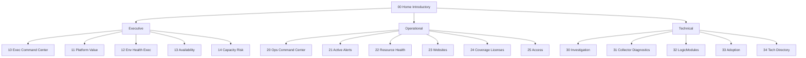

# SmartAdmin Connected Experience — LogicMonitor Dashboard Package

Distributable LogicMonitor dashboard package that tells a connected client story across **Home**, **Executive**, **Operational**, and **Technical** views.

## 1. Project Overview

This package is the **SmartAdmin Connected Experience** redesign (v2): seventeen dashboards organized so stakeholders can move from business value and risk to operational triage and technical root cause without losing context.

**Problem it solves:** Portal-admin metrics are powerful but often scattered. Clients struggle to see *why LogicMonitor matters* (coverage, noise, licenses, availability) and how to act next.

**Who should use it:** Customer Success, Solutions Consultants, portal administrators, NOC / operations leads, and platform engineers working in LogicMonitor.

**How it helps demonstrate LogicMonitor value:** Scorecards and trends reuse portal-admin and collector LogicModules already applied in mature portals, framed with progressive navigation and role-based entry points.

**How dashboards are connected:** Every dashboard includes the same suite navigation widget. Home is the lobby; Executive / Operational / Technical command centers fan out to specialist boards; Technical Directory links to OOTB technology packs.

## 2. Dashboard Architecture



Parent import group: **SmartAdmin Connected Experience**  
Subgroups: **Executive**, **Operational**, **Technical**  
Home (`00`) sits on the parent group’s dashboard list.

## 3. Dashboard Inventory

| Number | Dashboard | Group | Purpose | Intended Audience |
| ------ | --------- | ----- | ------- | ----------------- |
| 00 | Home / Introductory | Home (package root) | Lobby, role starts, environment summary | All users |
| 10 | Executive Command Center | Executive | Exec posture: alerts, collectors, footprint, licenses | Leadership, CS |
| 11 | Platform Value Overview | Executive | Value story: coverage, users, modules, licenses | Leadership, CS |
| 12 | Environment Health Executive | Executive | High-level environment / dead / minimal monitoring | Leadership, ops leads |
| 13 | Availability and Service Health | Executive | Website / service availability posture | Leadership, service owners |
| 14 | Capacity and Risk Overview | Executive | License and coverage risk signals | Leadership, FinOps |
| 20 | Operational Command Center | Operational | Ops cockpit and triage entry | NOC, ops |
| 21 | Active Alerts | Operational | Severity, rules, integrations, noise | NOC, ops |
| 22 | Resource Health | Operational | Resource / dead / collector health | Ops |
| 23 | Websites and Services | Operational | Website group health | Ops, service owners |
| 24 | Coverage, Capacity & Licenses | Operational | Licenses, netscans, unmonitored | Admins, FinOps |
| 25 | Access and Administration | Operational | Users, roles, API tokens | Security, portal admins |
| 30 | Technical Resource Investigation | Technical | Deep resource / alert investigation | Engineers |
| 31 | Collector Diagnostics | Technical | Collector JVM and task health | Platform engineers |
| 32 | LogicModule and Content | Technical | Module inventory and noisy content | Content owners |
| 33 | Adoption and Optimization | Technical | Continuous improvement / value loop | CS, admins |
| 34 | Technology Dashboard Directory | Technical | Links to OOTB Network/Server/Cloud packs | Engineers, ops |

JSON paths: [`dashboard-redesign/dashboards/`](dashboard-redesign/dashboards/).

## 4. Home / Introductory Dashboard

**Role:** Main entry point for the suite.

**Navigation:** Full suite menu with `CURRENT` on Home. Links use the approved proservices portal URLs from [`navigation/html/00-home-introductory.html`](navigation/html/00-home-introductory.html).

**Movement into groups:** Role cards and Where Next panels point to Executive (10/11), Operational (20/21), and Technical (30/34) starts.

**Summary information:** Portal alert, collector, resource, user, and license scorecards cloned from SmartAdmin / Introductive sources.

## 5. Executive Dashboards

| Dashboard | Purpose | Audience | Questions answered | Main widgets | Related | Drill-down |
| --------- | ------- | -------- | ------------------ | ------------ | ------- | ---------- |
| 10 Exec CC | Command center | Leadership | What is on fire? Collectors OK? Footprint? | bigNumber, alert, gmap, noc, guides | 11–14, 20, 30 | → Ops CC / Investigation |
| 11 Platform Value | Value narrative | CS, leadership | Are we covering and adopting? | bigNumber value KPIs | 00, 33 | → Adoption |
| 12 Env Health Exec | Environment posture | Leadership | Dead / minimal monitoring risk? | bigNumber, trends | 22, 21, 31 | → Resource Health |
| 13 Availability | Service health | Leadership | Are websites healthy? | Website KPIs | 23, 21, 34 | → Websites ops / OOTB |
| 14 Capacity Risk | License / coverage risk | Leadership, FinOps | Capacity or license pressure? | License / unmonitored KPIs | 24, 34 | → Coverage / Directory |

## 6. Operational Dashboards

| Dashboard | Purpose | Use case | Main widgets | Related | Drill-down |
| --------- | ------- | -------- | ------------ | ------- | ---------- |
| 20 Ops CC | Ops cockpit | Start of shift / triage | Scorecards, guides, nav | 21–25, 30 | → Active Alerts |
| 21 Active Alerts | Alert operations | Severity and noise | alert, tables, bigNumber | 22, 31, 32 | → Collectors / Modules |
| 22 Resource Health | Resource ops | Dead hosts / health | HostStatus, portal resources | 21, 31, 30 | → Investigation |
| 23 Websites | Website ops | Service checks | Website / group KPIs | 13, 21 | → Alerts / OOTB |
| 24 Coverage & Licenses | Capacity ops | License and discovery | LicenseCounts, netscans | 14, 33 | → Adoption |
| 25 Access | Identity / tokens | Idle users, API tokens | Users / Roles / APITokens | 33 | → Adoption |

## 7. Technical Dashboards

| Dashboard | Purpose | Troubleshooting use | Main widgets | Related | Drill-down |
| --------- | ------- | ------------------- | ------------ | ------- | ---------- |
| 30 Investigation | Root-cause hub | Correlate alerts and resources | Mixed technical KPIs | 21, 22, 31–34 | → Collectors / Modules / Directory |
| 31 Collector Diagnostics | Collector health | JVM / task backlog | Collector graphs & tables | 22, 30 | → Investigation |
| 32 LogicModule Content | Content inventory | Noisy modules | LogicModuleStatus scorecards | 21, 33 | → Adoption |
| 33 Adoption | Optimization | Is noise falling? Idle access? | Value/optimization KPIs | 11, 25 | → Platform Value |
| 34 Tech Directory | OOTB links | Technology deep dives | Directory table / cards | OOTB packs | → Network/Server/Cloud/… |

## 8. Navigation

- **Widget:** Text widget named **Suite Navigation Menu** on every dashboard.
- **CURRENT:** Exactly one `sa-nav-current` item per dashboard HTML.
- **Links:** Approved URLs from [`navigation/html/`](navigation/html/) (proservices portal IDs). Other portals must remint IDs/URLs after import.
- **Sources:** [`navigation/html/`](navigation/html/), library [`navigation/dashboard-navigation-table-library.md`](navigation/dashboard-navigation-table-library.md), generator [`navigation/generate_nav_library.py`](navigation/generate_nav_library.py).
- **Update process:**
  1. Edit or regenerate HTML under `navigation/html/`.
  2. Run `python dashboard-redesign/tools/inject_navigation.py`.
  3. Or rebuild with `build_redesign_v2.py` (loads the same HTML files).
  4. Validate with `python dashboard-redesign/tools/validate_navigation.py`.

## 9. Required LogicModules

Stored under [`modules/`](modules/). Identified by scraping final dashboard JSON for DataSource names plus documented portal-admin dependencies.

**Types in scope:** primarily DataSources (`LogicMonitor_Portal_*`, `LogicMonitor_Collector_*`, `HostStatus`).

**Status today:** Portal API export returned **401 Unauthorized** with the configured tokens. Modules are documented as **Requires portal export** (HostStatus = native; one alert-table filter = external). See [`modules/README.md`](modules/README.md).

**Import order:** Portal DataSources → Collector DataSources → confirm native HostStatus → validate datapoints → import dashboards.

Re-export after fixing credentials:

```bash
# copy config/lm_export_config.example.json → lm_export_config.json
python dashboard-redesign/tools/export_required_modules.py
```

## 10. Configuration Requirements

| Requirement | Detail |
|-------------|--------|
| Dashboard groups | Parent **SmartAdmin Connected Experience**; subgroups Executive / Operational / Technical |
| Resource / website groups | Driven by tokens `defaultResourceGroup`, `defaultWebsiteGroup` |
| Properties / tokens | `defaultResource` (often `*.logicmonitor.com`), `accountname` / `{{ACCOUNT_NAME}}` for licenses |
| Portal-specific IDs | Navigation URLs embed proservices dashboard/group IDs — **not portable** |
| OOTB IDs | Dashboard 34 may still reference `{{OOTB_*_ID}}` placeholders in directory widgets until OOTB packs are imported |
| Config file | Review [`config/lm_export_config.example.json`](config/lm_export_config.example.json); keep real credentials in gitignored `lm_export_config.json` |

Also see [`dashboard-redesign/validation/dependencies.md`](dashboard-redesign/validation/dependencies.md).

## 11. Installation and Import Order

1. Review prerequisites (portal permissions, LogicModules, OOTB packs if using Directory).
2. Import or validate required LogicModules ([`modules/README.md`](modules/README.md)).
3. Create / confirm resource and website group scopes.
4. Configure tokens (`accountname`, resource/website defaults).
5. Import Home via group file or `00_Home_Introductory_redesign_v2.json`.
6. Import Executive dashboards (10–14).
7. Import Operational dashboards (20–25).
8. Import Technical dashboards (30–34).
9. Prefer single import of [`SmartAdmin_Connected_Experience_redesign_v2.json`](dashboard-redesign/dashboards/SmartAdmin_Connected_Experience_redesign_v2.json) when possible.
10. Validate navigation links (update URLs if not proservices).
11. Validate widgets and data.
12. Review permissions and dashboard sharing.

## 12. Dashboard Validation

| Check | How |
|-------|-----|
| JSON validity | `python dashboard-redesign/tools/validate_redesign_v2.py` |
| Navigation | `python dashboard-redesign/tools/validate_navigation.py` → [`validation/navigation-validation.md`](validation/navigation-validation.md) |
| Widget / overlap / modules map | [`validation/dashboard-validation.md`](validation/dashboard-validation.md) |
| Dependencies | [`validation/dependency-validation.md`](validation/dependency-validation.md) |
| Portal rendering / data | **Portal testing required** — not claimed by repo automation |
| Tokens / filters / groups / time ranges / permissions / empty data | Confirm in target portal after import |

## 13. Known Dependencies and Limitations

- LogicModule XML exports **not included** until API credentials succeed (see CLEANUP_REPORT / modules README).
- Navigation URLs are proservices-specific.
- OOTB technology packs are external ([logicmonitor/dashboards](https://github.com/logicmonitor/dashboards)).
- PSC FortiGate / regional DCC metrics intentionally omitted (chrome only).
- HTML text-widget rendering can vary by LM UI version.
- Metrics may be empty if modules, tokens, or scopes are missing.
- This repository does **not** claim live portal widget validation beyond static JSON/nav checks.

## 14. Repository Structure

```text
/
├── README.md                 # This file
├── CLEANUP_REPORT.md         # Deletion log
├── dashboard_feedback.md     # Nav design heritage
├── .gitignore
├── config/                   # Example API export config
├── dashboard-redesign/       # Final dashboards, tools, design system, package docs
├── navigation/               # Approved HTML nav + generator
├── modules/                  # LogicModule mapping (+ XML when exported)
├── validation/               # Deliverable validation reports
└── Basement/                 # Rebuild source JSON (do not treat as ship dashboards)
```

## 15. Maintenance

| Task | Steps |
|------|-------|
| Add a dashboard | Extend `build_redesign_v2.py` + `NAV_HTML_BY_ID` + `navigation/generate_nav_library.py`; rebuild; inject nav; update README inventory |
| Update navigation | Edit HTML or regenerate; `inject_navigation.py`; `validate_navigation.py` |
| Add LogicModule dependency | Ensure widgets reference it; re-run exporter; update `modules/README.md` |
| Validate JSON | `validate_redesign_v2.py` |
| Replace a dashboard version | Rebuild or edit under `dashboard-redesign/dashboards/`; re-inject nav; refresh group JSON |
| Remove a dashboard | Remove from build specs, nav library, README, modules mapping; inject remaining nav |
| Keep docs current | Update root README, `modules/README.md`, and `validation/*` together |

### Rebuild commands

```bash
python dashboard-redesign/tools/build_redesign_v2.py
python dashboard-redesign/tools/inject_navigation.py
python dashboard-redesign/tools/validate_navigation.py
python dashboard-redesign/tools/validate_redesign_v2.py
python dashboard-redesign/tools/export_required_modules.py
```

## License / sharing

Share this repository as a dashboard package. Do **not** commit `lm_export_config.json` (contains secrets). Use the example under `config/`.
