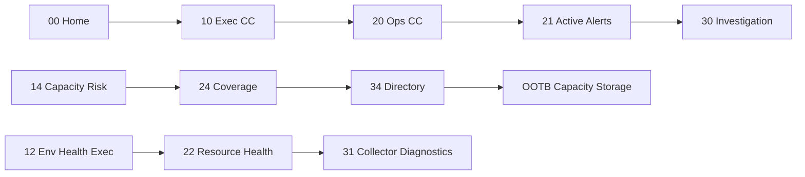

# Dashboard Relationship Map

## Relationship table

| From | To | Relationship |
|------|----|--------------|
| 00 Home | 10 / 20 / 30 | Role entry to command centers / investigation |
| 00 Home | 11 / 21 / 34 | Value, triage, technology directory |
| 10 Exec CC | 11 / 12 / 13 / 14 | Executive siblings |
| 10 Exec CC | 20 / 21 | Operational drill |
| 10 Exec CC | 30 / 31 | Technical drill |
| 14 Capacity Risk | 24 | Operational license/coverage detail |
| 14 Capacity Risk | 34 | OOTB capacity / storage / compute |
| 13 Availability | 23 / 21 / 34 | Websites ops + alerts + OOTB websites |
| 12 Env Health Exec | 22 / 21 / 31 | Ops resource health, alerts, collectors |
| 20 Ops CC | 21 / 22 / 23 / 30 | Triage paths |
| 21 Active Alerts | 31 / 32 / 22 / 30 | Collector, modules, spatial, investigation |
| 22 Resource Health | 21 / 31 / 23 / 24 / 30 | Cross-ops + technical |
| 30 Investigation | 31 / 32 / 33 / 34 / 21 / 22 | Diagnostic fan-out |
| 34 Directory | OOTB IDs | Network / Server / Virt / Storage / Cloud / Capacity |
| 33 Adoption | 11 | Close the loop to platform value |

## Mermaid — hierarchy

## Mermaid — primary journeys

## User journeys

1. **Leadership review:** Home → Executive Command Center → Platform Value or Capacity Risk → Operational Command Center if action needed → Technical Investigation if root cause needed.
2. **Capacity risk:** Capacity Risk Overview → Coverage/Licenses → Technology Directory → OOTB Capacity/Storage.
3. **Environment / collector:** Env Health Exec → Resource Health → Collector Diagnostics.
4. **Service availability:** Availability Exec → Websites and Services → Active Alerts → OOTB Websites via Directory.
5. **Noise reduction:** Active Alerts → LogicModule and Content → Adoption and Optimization → Platform Value.
