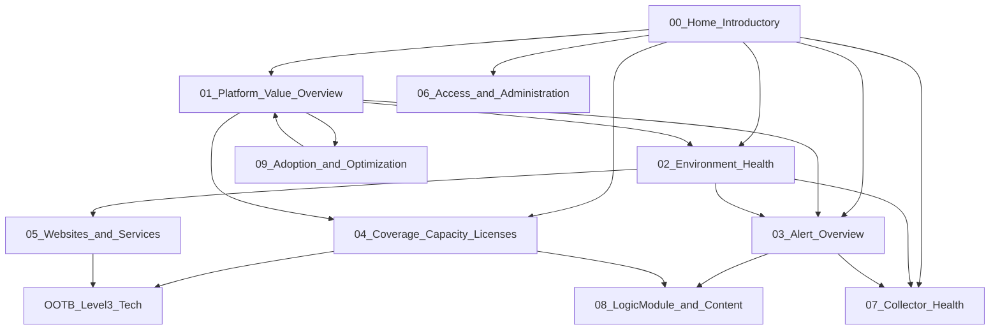

# Dashboard Relationship Map

## Hierarchy

## Relationship table

| Source Dashboard | Navigation Item | Destination Dashboard | Preserved Context | Purpose |
|------------------|-----------------|----------------------|-------------------|---------|
| 00 Home | Platform Value | 01 Platform Value Overview | `defaultResourceGroup` | Executive start |
| 00 Home | Environment | 02 Environment Health | group token | Ops start |
| 00 Home | Alerts | 03 Alert Overview | group token | Triage start |
| 00 Home | Coverage | 04 Coverage, Capacity & Licenses | group + `accountname` | Blind spots / licenses |
| 00 Home | Admin | 06 Access and Administration | group token | Security start |
| 00 Home | Collectors | 07 Collector Health | collector tokens | Pipeline start |
| 00 Home | OOTB tech links | Capacity / Cloud / Network / … | Document post-import IDs | Infra drill-out |
| 01 Platform Value | Environment | 02 | group token | Drill on map/NOC/dead signals |
| 01 Platform Value | Alerts | 03 | group token | Elevated severity |
| 01 Platform Value | Coverage | 04 | group + account | License / footprint questions |
| 01 Platform Value | Collectors | 07 | collector tokens | Down collectors |
| 01 Platform Value | Adoption | 09 | group token | Value / improvement story |
| 02 Environment Health | Alerts | 03 | group token | Active exceptions |
| 02 Environment Health | Collectors | 07 | collector tokens | Collector-caused gaps |
| 02 Environment Health | Websites | 05 | `defaultWebsiteGroup` | Website risk |
| 03 Alert Overview | Collectors | 07 | collector tokens | Collector alerts |
| 03 Alert Overview | Modules | 08 | group token | Noisy LogicModules |
| 03 Alert Overview | Environment | 02 | group token | Spatial / type concentration |
| 04 Coverage | Modules | 08 | group token | Content vs coverage |
| 04 Coverage | OOTB Capacity / Cloud | External OOTB | `defaultResourceGroup` | Host/cloud utilization |
| 05 Websites | OOTB Websites | External OOTB | `defaultWebsiteGroup` | Deep website performance |
| 06 Access | Adoption | 09 | group token | Idle access trends |
| 07 Collectors | Environment | 02 | group token | Return to ops view |
| 08 Modules | Alerts | 03 | group token | Ops noise context |
| 09 Adoption | Platform Value | 01 | group token | Close the loop |

## User journeys

### Executive

1. Open **00** → card **Executive health** → **01**  
2. Scan KPI strip + map/NOC  
3. If red/yellow → **03** or **02**  
4. For value storytelling → **09**

### NOC / operator

1. **00** → **Triage alerts** → **03**  
2. Use alert list + trends + rules  
3. Collector alerts → **07**; noisy modules → **08**  
4. Spatial concentration → **02**

### Portal admin / FinOps

1. **00** → **Coverage** → **04**  
2. Review licenses, netscans, unmonitored  
3. Website hygiene → **05**; modules → **08**

### Platform engineer

1. **00** → **Collectors** → **07**  
2. JVM / slow tasks / method graphs  
3. Return via Environment or Alerts

## Preserved context rules

- **Tokens** travel with the dashboard group defaults after import; set once at group or dashboard level.
- **Dashboard IDs / URLs** are portal-specific — placeholders only in HTML.
- **Time range** is per-widget in LM exports; not globally linkable via HTML href without portal UI state.
- Do not hardcode customer resource group paths; use `*` or client-provided token values.
