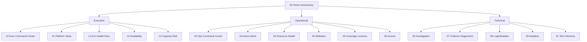
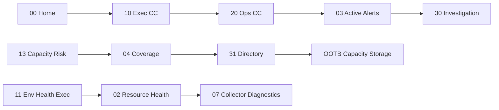

# Dashboard Relationship Map

## Relationship table

| From | To | Relationship |
|------|----|--------------|
| 00 Home | 10 / 20 / 30 | Role entry to command centers / investigation |
| 00 Home | 01 / 03 / 31 | Value, triage, technology directory |
| 10 Exec CC | 01 / 11 / 12 / 13 | Executive siblings |
| 10 Exec CC | 20 / 03 | Operational drill |
| 10 Exec CC | 30 / 07 | Technical drill |
| 13 Capacity Risk | 04 | Operational license/coverage detail |
| 13 Capacity Risk | 31 | OOTB capacity / storage / compute |
| 12 Availability | 05 / 03 / 31 | Websites ops + alerts + OOTB websites |
| 11 Env Health Exec | 02 / 03 / 07 | Ops resource health, alerts, collectors |
| 20 Ops CC | 03 / 02 / 05 / 30 | Triage paths |
| 03 Active Alerts | 07 / 08 / 02 / 30 | Collector, modules, spatial, investigation |
| 02 Resource Health | 03 / 07 / 05 / 04 / 30 | Cross-ops + technical |
| 30 Investigation | 07 / 08 / 09 / 31 / 03 / 02 | Diagnostic fan-out |
| 31 Directory | OOTB IDs | Network / Server / Virt / Storage / Cloud / Capacity |
| 09 Adoption | 01 | Close the loop to platform value |

## Mermaid — hierarchy

## Mermaid — primary journeys

## User journeys

1. **Leadership review:** Home → Executive Command Center → Platform Value or Capacity Risk → Operational Command Center if action needed → Technical Investigation if root cause needed.  
2. **Capacity risk:** Capacity Risk Overview → Coverage/Licenses → Technology Directory → OOTB Capacity/Storage.  
3. **Environment / collector:** Env Health Exec → Resource Health → Collector Diagnostics.  
4. **Service availability:** Availability Exec → Websites and Services → Active Alerts → OOTB Websites via Directory.  
5. **Noise reduction:** Active Alerts → LogicModule and Content → Adoption and Optimization → Platform Value.
