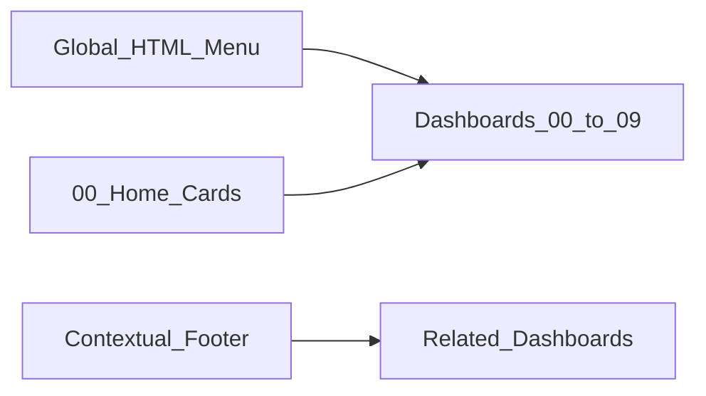

# Navigation Design

## Model

**Combination:** compact global HTML menu on every dashboard + Home navigation cards + contextual “Where next” footers.



## Why this model

| Option | Verdict |
|--------|---------|
| Horizontal menu only | Good orientation; insufficient for first-time users |
| Side panel | Consumes scarce dashboard grid width |
| Home cards only | Strong entry; weak when deep in L3 |
| Breadcrumbs only | LM text widgets cannot reliably track history |
| Dynamic JS list | Powerful but portal-API / script dependent — optional |
| **Global menu + Home cards + footers** | Best balance for static, portable HTML |

## Visual language

- Background `#0b1220`, border `#1f2937`, text `#e5e7eb`, accent `#38bdf8`
- Current section: brighter border + `Current` label (CSS only)
- Theme wrapper: `newSolidDarkBlue`
- No Harvard crimson; no new JS in core nav

## Global menu items

| Label | Destination |
|-------|-------------|
| Home | 00 - Home / Introductory |
| Platform Value | 01 - Platform Value Overview |
| Environment | 02 - Environment Health |
| Alerts | 03 - Alert Overview |
| Coverage | 04 - Coverage, Capacity & Licenses |
| Websites | 05 - Websites and Services |
| Admin | 06 - Access and Administration |
| Collectors | 07 - Collector Health |
| Modules | 08 - LogicModule and Content |
| Adoption | 09 - Adoption and Optimization |

Links use placeholders:

```html
<a href="{{PORTAL_BASE}}/uiv4/dashboard/{{DASHBOARD_ID_01}}" ...>
```

Until configured, labels remain readable as a map of the suite.

## Home cards (role-based)

| Card | Audience | Starts at |
|------|----------|-----------|
| Executive health | Leadership | 01 |
| Triage alerts | NOC / ops | 03 |
| Environment risk | Ops | 02 |
| Coverage & licenses | Admins / FinOps | 04 |
| Access hygiene | Security | 06 |
| Collector pipeline | Platform engineers | 07 |

## Unsupported / optional patterns

| Pattern | Source | Status |
|---------|--------|--------|
| Dynamic Dashboard List v2.x | `_DynamicDashboardGroups`, `_Example_Exec` | Optional; requires portal API from text widget; **portal validation required** |
| FilterWidget v7 | `_FilterWidget_v7` | Optional resource regex wizard; **portal validation required** |
| Better Map Widget CDN JS | `_Example_Exec` | Optional; not in core pack |

## Cloning / import safety

- No hardcoded customer names or credentials
- Dashboard IDs must be filled per portal
- Suite remains operational when links are unresolved (metrics still render)
